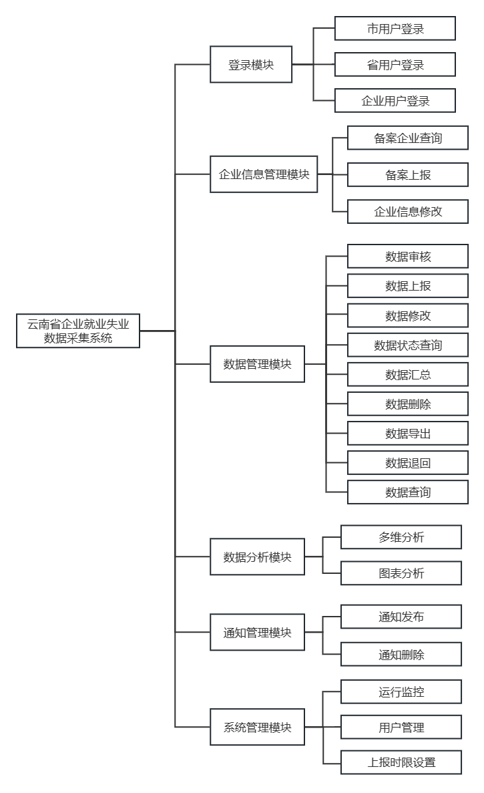
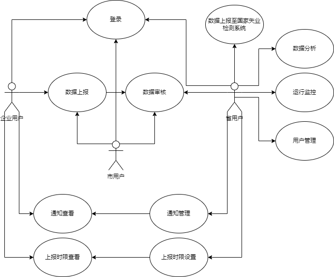
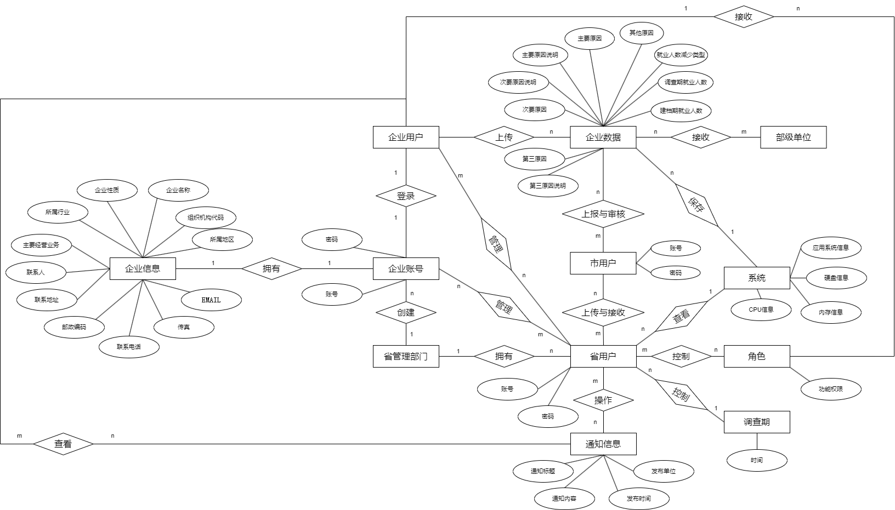
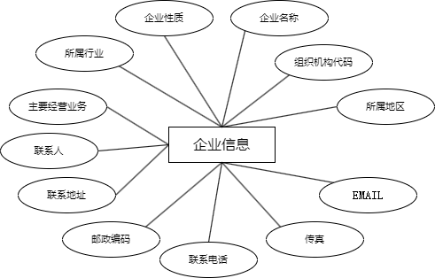
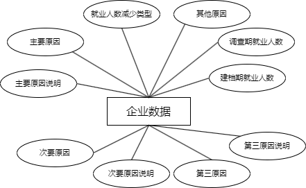
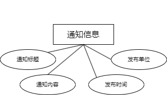
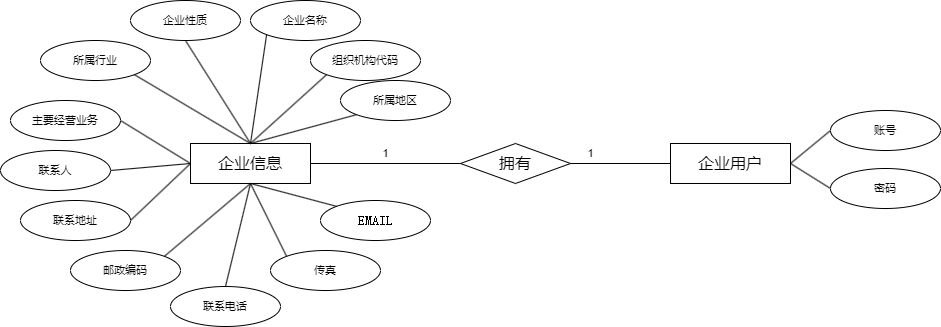
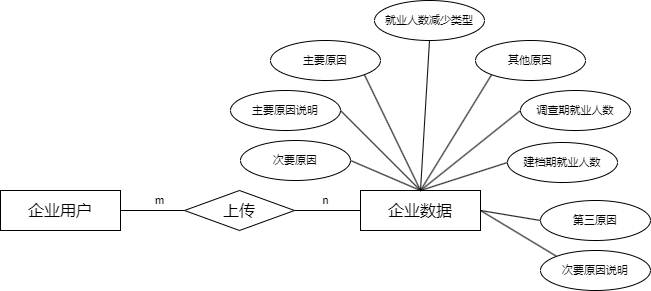
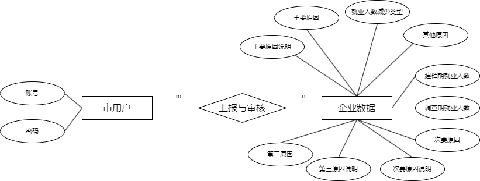

# 需求规格说明书

## 一、 引言

### 1.1 定位与目标

本文档是针对“云南省企业就业失业数据采集系统”项目的需求规格说明书。该系统旨在帮助企业用户和省用户采集和管理企业就业失业数据，实现数据的上报、审核、汇总和分析，为政府部门提供数据支撑，辅助决策。该系统的目标是提高数据采集和管理的效率，规范数据的采集和上报流程，减少数据处理的错误和漏洞，提高数据的准确性和实时性。

### 1.2 对象

本《需求规格说明书》的预期读者是：

* 系统开发经理
* 技术部经理
* 项目组所有人员
* 测试组人员
* 授权调阅本文档的其他人员

### 1.3 软件需求分析理论

软件需求分析是软件工程领域中非常重要的一个环节，它是软件开发生命周期中的第一个环节，也是最为关键的环节之一。软件需求分析是指对软件系统的需求进行调查、分析、记录、确认和管理的过程，以便于软件开发人员能够正确地理解用户需求、设计出满足用户需求的系统，并且在开发过程中不断进行验证和确认，保证最终交付的系统能够满足用户需求和系统质量要求。因此，一个项目的成功软件需求分析是关键的一步。

### 1.4 软件需求分析目标

本文档的目标是对“云南省企业就业失业数据采集系统”的需求进行详细的阐述和说明，包括用户需求、功能需求、流程需求等方面的内容，帮助开发人员更好地理解用户需求，并且在软件开发过程中不断进行需求确认和变更管理，为软件设计、确认和验证提供一个基准，确保最终交付的系统能够满足用户需求和系统质量要求。

## 二、 需求概述

### 2.1 项目背景

本系统是为了满足云南省政府部门对企业就业失业数据的需求而设计开发的。通过该系统，企业用户可以方便地填报就业失业数据，并且及时上报到省级管理部门，省级管理部门可以对数据进行审核、汇总和分析，并且及时上报到中央政府，为政府决策提供数据支撑。

### 2.2 需求概述

该系统需要满足以下功能需求：

1. 企业用户能够在系统中修改企业基本信息，上报备案信息和填报就业人数。
2. 市用户能够在每月上报数据到市，经过审核后上报到省。
3. 省级管理部门能够审核上报的数据并进行汇总上报，对备案企业进行查询、数据修改、数据删除、数据退回、数据导出等操作。
4. 省级管理部门能够对全省已创建用户进行条件查询，用多维和图表方式分析全省企业岗位变动情况，发布和删除通知信息。
5. 系统管理模块可以设置上报时限，管理用户和监控系统运行情况。

该系统的数据填报模板应按照规范要求设计，确保填报数据的规范性和可比性。同时，系统应具备安全性，保障企业和省级管理部门的信息安全。

### 2.3 系统结构

该系统采用B/S架构，包括前端页面、后台服务和数据库三部分，具体结构如下：

1. 前端页面：包括登录、注册、信息填报、备案上报、数据查询、数据展示等功能。
2. 后台服务：负责数据存储、处理、逻辑计算和业务逻辑控制，包括数据采集、数据校验、数据汇总、数据导出、用户管理、权限控制等功能。
3. 数据库：采用关系型数据库，用于存储企业和省级管理部门的相关数据。数据表包括企业基本信息表、备案信息表、填报数据表、用户信息表、权限表等。

该系统应能够稳定运行，并能够根据用户需求进行升级和扩展。

<figure><figcaption>
图2.1 系统结构
</figcaption></figure>

## 三、 系统功能需求

### 3.1 功能总览

| 功能     | 具体描述                                                            | 可使用此功能的系统角色  |
| ------ | --------------------------------------------------------------- | ------------ |
| 登录系统   | 用户通过账号登录系统。                                                     | 省用户，企业用户，市用户 |
| 企业信息   | 修改企业基本信息，然后上报到省备案。                                              | 企业用户         |
| 企业数据操作 | 填报企业就业人数，查询以往调查期数据状态。                                           | 企业用户         |
| 企业查询   | 查看各市已备案企业信息，按需要对备案企业进行查询。                                       | 省用户          |
| 报表管理   | 审核上报的数据并汇总上报。                                                   | 省用户，市用户      |
| 省数据操作  | 修改企业上报数据，删除历史数据，退回上报数据，查询汇总表，按报送期导出企业信息、企业报表等数据，对全省已创建用户进行条件查询。 | 省用户          |
| 数据分析   | 用多维方式和图表方式分析全省企业岗位变动情况。                                         | 省用户          |
| 发布通知   | 发布、删除通知信息。                                                      | 省用户          |
| 系统管理   | 设置上报时限、管理用户、监控系统运行情况。                                           | 省用户          |

表 3.1 功能总览

### 3.2 业务流程图

该系统是基于网络技术的企业就业失业数据采集系统。省管理部门通过系统管理模块创建企业账号，企业通过账号登录系统，补充企业基础信息，然后上报到省备案，备案通过后可以每月上报数据；每个月企业按省规定的时间上报本企业就业失业情况，上报到市局，市局审核通过后上报到省局，省局审核汇总后上报到部委，省局对上报的数据进行分析汇总并以图形形式显示。

<figure><figcaption>
图3.1 业务流程图
</figcaption></figure>

### 3.3 用例图

<figure><figcaption></figcaption></figure>

### 3.4 功能描述

#### 3.4.1 企业用户

| 3.4.1.1 | 备案信息                                                                                                                                                                                                                                                                                                                                                                                                                                                                                                                                                                                                                                                                                                                                                                                    |
| ------- | --------------------------------------------------------------------------------------------------------------------------------------------------------------------------------------------------------------------------------------------------------------------------------------------------------------------------------------------------------------------------------------------------------------------------------------------------------------------------------------------------------------------------------------------------------------------------------------------------------------------------------------------------------------------------------------------------------------------------------------------------------------------------------------- |
| 功能描述    | 企业用户可以录入和修改企业详细信息的内容，按照统一规范的模板进行填写和修改。                                                                                                                                                                                                                                                                                                                                                                                                                                                                                                                                                                                                                                                                                                                                                  |
| 权限描述    | 仅企业用户可以使用                                                                                                                                                                                                                                                                                                                                                                                                                                                                                                                                                                                                                                                                                                                                                                               |
| 数据说明    | 

需要按照如下数据说明表进行数据设计
<table><thead><tr><th>数据项</th><th>必填</th><th>说明</th></tr></thead><tbody><tr><td>所属地区</td><td>是</td><td>显示企业所属地市、市县、区域，不可修改</td></tr><tr><td>组织机构代码</td><td>是</td><td>只可输入字母、数字，不超过9位（统一编码规范）</td></tr><tr><td>企业名称</td><td>是</td><td>中文、英文</td></tr><tr><td>企业性质</td><td>是</td><td>两级下拉选择</td></tr><tr><td>所属行业</td><td>是</td><td>两级下拉选择</td></tr><tr><td>主要经营业务</td><td>是</td><td>按实际情况填写企业主要经营的业务</td></tr><tr><td>联系人</td><td>是</td><td>中文、英文</td></tr><tr><td>联系地址</td><td>是</td><td>两级下拉选择</td></tr><tr><td>邮政编码</td><td>是</td><td>只可填写6位数字</td></tr><tr><td>联系电话</td><td>是</td><td>格式必须符合（区号）+电话号码或者为手机号码</td></tr><tr><td>传真</td><td>是</td><td>格式必须符合（区号）+电话</td></tr><tr><td>EMAIL</td><td>否</td><td>格式必须符合xxx@xxx.xxx</td></tr></tbody></table> |

| 3.4.1.2 | 数据填报                                                                                                                                                                                                                                                                                                                                                                                                                                                                                                                                                                                                                                                                                                                                                                                                                                                                                                         |
| ------- | ------------------------------------------------------------------------------------------------------------------------------------------------------------------------------------------------------------------------------------------------------------------------------------------------------------------------------------------------------------------------------------------------------------------------------------------------------------------------------------------------------------------------------------------------------------------------------------------------------------------------------------------------------------------------------------------------------------------------------------------------------------------------------------------------------------------------------------------------------------------------------------------------------------ |
| 功能描述    | 企业用户可以使用模板填报当期采集数据，填写后可以保存，保存后可以上报。                                                                                                                                                                                                                                                                                                                                                                                                                                                                                                                                                                                                                                                                                                                                                                                                                                                                          |
| 权限描述    | 仅企业用户可以使用                                                                                                                                                                                                                                                                                                                                                                                                                                                                                                                                                                                                                                                                                                                                                                                                                                                                                                    |
| 数据说明    | 
需要按照如下数据说明进行数据设计
<table><thead><tr><th>数据项</th><th>必填</th><th>说明</th></tr></thead><tbody><tr><td>建档期就业人数</td><td>是</td><td>填写初次将档时监测点就业人数</td></tr><tr><td>调查期就业人数</td><td>是</td><td>填写本次调查期当时的监测点就业人数</td></tr><tr><td>其他原因</td><td>是</td><td></td></tr><tr><td>就业人数减少类型</td><td>否</td><td></td></tr><tr><td>主要原因</td><td>否</td><td></td></tr><tr><td>主要原因说明</td><td>否</td><td></td></tr><tr><td>联系人</td><td>否</td><td></td></tr><tr><td>次要原因</td><td>否</td><td></td></tr><tr><td>次要原因说明</td><td>否</td><td></td></tr><tr><td>第三原因</td><td>否</td><td></td></tr><tr><td>第三原因说明</td><td>否</td><td></td></tr></tbody></table>
如果调查期数据小于建档期数据，就业人数减少类型和就业人数减少主要原因及说明必填。

就业人数减少类型包括：关闭破产、停业整顿、经济性裁员、业务转移、自然减员、正常解除或终止劳动合同、国际因素变化影响、自然灾害、重大事件影响、其他。

就业人数减少原因包括：产业结构调整，重大技术改革，节能减排、淘汰落后产能，订单不足，原材料涨价，工资、社保等用工成本上升，自然减员，经营资金困难，税收政策变化（包括税负增加或出口退税减少等），季节性用工，其他，自行离职，工作调动、企业内部调剂，劳动关系转移、劳务派遣。
 |

| 3.4.1.3 | 数据查询                                            |
| ------- | ----------------------------------------------- |
| 功能描述    | 企业用户可以指定条件查询自己以往调查期企业数据的状态。企业用户下查询结果只可以浏览不可以导出。 |
| 权限描述    | 仅企业用户可以使用                                       |

| 3.4.1.4 | 浏览通知                                                                                                                                                                                                     |
| ------- | -------------------------------------------------------------------------------------------------------------------------------------------------------------------------------------------------------- |
| 功能描述    | 浏览查看通知信息                                                                                                                                                                                                 |
| 权限描述    | 企业用户可以使用                                                                                                                                                                                                 |
| 子功能描述   | 

<table><thead><tr><th>功能</th><th>描述</th></tr></thead><tbody><tr><td>列表</td><td>列出所有上级用户发布的所有通知信息。列表项包括：标题、发布时间</td></tr><tr><td>查看</td><td>点击查看详细通知信息。包括：通知标题，发布时间，通知内容</td></tr></tbody></table> |

#### 3.4.2 市用户

| 3.4.2.1 | 报表管理                                                                                                                                                                                                                                                                                    |
| ------- | --------------------------------------------------------------------------------------------------------------------------------------------------------------------------------------------------------------------------------------------------------------------------------------- |
| 功能描述    | 审核企业上报的数据并汇总上报到省                                                                                                                                                                                                                                                                        |
| 权限描述    | 市用户可以使用                                                                                                                                                                                                                                                                                 |
| 子功能描述   | 

<table><thead><tr><th>功能</th><th>描述</th></tr></thead><tbody><tr><td>查看</td><td>查看企业上报的数据和报表</td></tr><tr><td>退回修改</td><td>将企业上报的数据和报表退回修改。退回修改时可以添加备注，标识退回理由</td></tr><tr><td>审核通过</td><td>将企业上报的数据和报表审核通过</td></tr><tr><td>上报</td><td>将企业上报的数据上报到部级单位</td></tr></tbody></table> |

#### 3.4.3 省用户

| 3.4.3.1 | 企业备案查询                                                                                                                                                                                                                                                                        |
| ------- | ----------------------------------------------------------------------------------------------------------------------------------------------------------------------------------------------------------------------------------------------------------------------------- |
| 功能描述    | 省用户下可以查看已备案企业的详细信息，但不可以修改。                                                                                                                                                                                                                                                    |
| 权限描述    | 省用户可以使用                                                                                                                                                                                                                                                                       |
| 子功能描述   | 

<table><thead><tr><th>功能</th><th>描述</th></tr></thead><tbody><tr><td>列表</td><td>显示所有已备案的企业</td></tr><tr><td>查询</td><td>根据调查期和地区的查询条件进行检索</td></tr><tr><td>查看</td><td>查看企业的详细信息</td></tr><tr><td>导出EXCEL</td><td>省用户可以将当前的列表导出为EXCEL文件并保存在本地磁盘</td></tr></tbody></table> |

| 3.4.3.2 | 报表管理                                                                                                                                                                                                                                                                                    |
| ------- | --------------------------------------------------------------------------------------------------------------------------------------------------------------------------------------------------------------------------------------------------------------------------------------- |
| 功能描述    | 审核企业上报的数据并汇总上报到部级单位                                                                                                                                                                                                                                                                     |
| 权限描述    | 省用户可以使用                                                                                                                                                                                                                                                                                 |
| 子功能描述   | 

<table><thead><tr><th>功能</th><th>描述</th></tr></thead><tbody><tr><td>查看</td><td>查看企业上报的数据和报表</td></tr><tr><td>退回修改</td><td>将企业上报的数据和报表退回修改。退回修改时可以添加备注，标识退回理由</td></tr><tr><td>审核通过</td><td>将企业上报的数据和报表审核通过</td></tr><tr><td>上报</td><td>将企业上报的数据上报到部级单位</td></tr></tbody></table> |

| 3.4.3.3 | 数据汇总                                                                                                                                                                                                                               |
| ------- | ---------------------------------------------------------------------------------------------------------------------------------------------------------------------------------------------------------------------------------- |
| 功能描述    | 查看企业的汇总数据，可以修改明显错误的数据                                                                                                                                                                                                              |
| 权限描述    | 省用户可以使用                                                                                                                                                                                                                            |
| 子功能描述   | 

<table><thead><tr><th>功能</th><th>描述</th></tr></thead><tbody><tr><td>数据汇总</td><td>查看企业的汇总数据，根据不同的调查期显示出企业的汇总数据</td></tr><tr><td>数据修改</td><td>可以对有明显错误的企业数据进行修改。修改后的数据另外存储并不修改报送的原始数据。原始数据和修改日志要保留。</td></tr></tbody></table> |

| 3.4.3.4 | 图表分析                                                                                                                                                                                                                                                                                                                          |
| ------- | ----------------------------------------------------------------------------------------------------------------------------------------------------------------------------------------------------------------------------------------------------------------------------------------------------------------------------- |
| 功能描述    | 通过图表显示企业情况以及岗位变动情况                                                                                                                                                                                                                                                                                                            |
| 权限描述    | 仅省用户可以使用                                                                                                                                                                                                                                                                                                                      |
| 子功能描述   | 

<table><thead><tr><th>功能</th><th>描述</th></tr></thead><tbody><tr><td>取样分析</td><td>显示各市企业的数量和占比以及相应的饼图。可以通过地区查询条件进行限定。</td></tr><tr><td>对比分析</td><td>通过选择两个调查期、样本条件、分析方式（地区、企业性质、行业）少眩统计数据，使用折线图、表格形式对比两个调查期的企业岗位变动情况</td></tr><tr><td>趋势分析</td><td>通过统计岗位变化数量占比，使用折线图、表格形式展示多个连续调查期内的企业岗位变动情况</td></tr></tbody></table> |

| 3.4.3.5 | 数据查询与导出                                                                                                                                                                                                                                                                                             |
| ------- | --------------------------------------------------------------------------------------------------------------------------------------------------------------------------------------------------------------------------------------------------------------------------------------------------- |
| 功能描述    | 对全省已创建账号进行条件查询                                                                                                                                                                                                                                                                                      |
| 权限描述    | 仅省用户可以使用                                                                                                                                                                                                                                                                                            |
| 子功能描述   | 

<table><thead><tr><th>功能</th><th>描述</th></tr></thead><tbody><tr><td>查询</td><td>按找相应的查询条件进行查询</td></tr><tr><td>清除</td><td>清除查询条件</td></tr><tr><td>导出</td><td>导出查询后数据</td></tr><tr><td>查询条件</td><td>单位名称、登陆账号、用户类型、所属地市、所属市县、所处区域、数据状态、单位性质、所属行业、起始日期、结束日期、统计月份、统计季度</td></tr></tbody></table> |

| 3.4.3.6 | 通知管理                                                                                                                                                                                                                                                                                                                                                                                                                                                                                                                                                                                                                           |
| ------- | ------------------------------------------------------------------------------------------------------------------------------------------------------------------------------------------------------------------------------------------------------------------------------------------------------------------------------------------------------------------------------------------------------------------------------------------------------------------------------------------------------------------------------------------------------------------------------------------------------------------------------ |
| 功能描述    | 浏览查看、发布、删除通知信息                                                                                                                                                                                                                                                                                                                                                                                                                                                                                                                                                                                                                 |
| 权限描述    | 仅省用户可以使用                                                                                                                                                                                                                                                                                                                                                                                                                                                                                                                                                                                                                       |
| 子功能描述   | 

<table><thead><tr><th>功能</th><th>描述</th></tr></thead><tbody><tr><td>列表</td><td>列出当前用户发布的所有通知信息。列表项包括：标题、发布时间</td></tr><tr><td>查看</td><td>点击查看详细通知信息。包括：通知标题，发布时间，通知内容</td></tr><tr><td>新增</td><td>
新增一条通知信息。数据项包括
<table><thead><tr><th>数据项</th><th>必填</th><th></th></tr></thead><tbody><tr><td>通知标题</td><td>是</td><td>50字以内</td></tr><tr><td>发布内容</td><td>是</td><td>2000字以内</td></tr><tr><td>发布时间</td><td>否</td><td>系统自动生成</td></tr><tr><td>发布单位</td><td>否</td><td>系统自动生成</td></tr></tbody></table></td></tr><tr><td>修改</td><td>选择一条通知，进行修改。数据项同新增</td></tr><tr><td>删除</td><td>删除一条通知信息</td></tr></tbody></table> |

3.4.3.7 系统管理

| 3.4.3.7.1 | 上报时限                                                                                                                                                            |
| --------- | --------------------------------------------------------------------------------------------------------------------------------------------------------------- |
| 功能描述      | 新增或修改调查期                                                                                                                                                        |
| 权限描述      | 仅省用户可以使用                                                                                                                                                        |
| 子功能描述     | 

<table><thead><tr><th>功能</th><th>描述</th></tr></thead><tbody><tr><td>新增</td><td>新增一个调查期</td></tr><tr><td>修改</td><td>修改已有的调查期的时间</td></tr></tbody></table> |

| 3.4.3.7.2 | 用户管理                                                                                                                                                                                                                                                                  |
| --------- | --------------------------------------------------------------------------------------------------------------------------------------------------------------------------------------------------------------------------------------------------------------------- |
| 功能描述      | 建立企业用户                                                                                                                                                                                                                                                                |
| 权限描述      | 仅省用户可以使用                                                                                                                                                                                                                                                              |
| 子功能描述     | 

<table><thead><tr><th>功能</th><th>描述</th></tr></thead><tbody><tr><td>列表</td><td>列出所有用户信息</td></tr><tr><td>新增</td><td>新增一条用户信息。同时为该用户分配角色</td></tr><tr><td>删除</td><td>删除用户信息。如有该用户上报的数据，则不能删除</td></tr><tr><td>修改</td><td>修改信息，界面同新增类似</td></tr></tbody></table> |

| 3.4.3.7.3 | 角色管理                                                                                                                                                                                                                                                     |
| --------- | -------------------------------------------------------------------------------------------------------------------------------------------------------------------------------------------------------------------------------------------------------- |
| 功能描述      | 根据需要建立多种角色，不同角色对应不同功能。系统预定义一些角色。                                                                                                                                                                                                                         |
| 权限描述      | 仅省用户可以使用                                                                                                                                                                                                                                                 |
| 子功能描述     | 

<table><thead><tr><th>功能</th><th>描述</th></tr></thead><tbody><tr><td>角色定义</td><td>定义新角色，分配功能权限</td></tr><tr><td>角色修改</td><td>修改角色的功能权限</td></tr><tr><td>角色删除</td><td>删除角色，如该角色已分配给用户，提示后删除角色和该角色与用户的关联关系。删除后需要为用户重新分配角色。</td></tr></tbody></table> |

| 3.4.3.7.4 | 系统监控                                |
| --------- | ----------------------------------- |
| 功能描述      | 查看当前系统工作情况。包括CPU、内存、硬盘等信息和应用系统的一些信息 |
| 权限描述      | 仅省用户可以使用                            |

#### 3.4.4 数据接口

| 3.4.4 | 数据接口                                                                                                                                                                                                                                                                                                                                                                                                                                                                                                                                                                                                                                                                                                                                                                                                                                                                                                         |
| ----- | ------------------------------------------------------------------------------------------------------------------------------------------------------------------------------------------------------------------------------------------------------------------------------------------------------------------------------------------------------------------------------------------------------------------------------------------------------------------------------------------------------------------------------------------------------------------------------------------------------------------------------------------------------------------------------------------------------------------------------------------------------------------------------------------------------------------------------------------------------------------------------------------------------------ |
| 功能描述  | 实现与国家失业监测系统的数据交换                                                                                                                                                                                                                                                                                                                                                                                                                                                                                                                                                                                                                                                                                                                                                                                                                                                                                             |
| 权限描述  | 仅企业用户可以使用                                                                                                                                                                                                                                                                                                                                                                                                                                                                                                                                                                                                                                                                                                                                                                                                                                                                                                    |
| 数据说明  | 
需要按照如下数据说明进行数据设计
<table><thead><tr><th>数据项</th><th>必填</th><th>说明</th></tr></thead><tbody><tr><td>建档期就业人数</td><td>是</td><td>填写初次将档时监测点就业人数</td></tr><tr><td>调查期就业人数</td><td>是</td><td>填写本次调查期当时的监测点就业人数</td></tr><tr><td>其他原因</td><td>是</td><td></td></tr><tr><td>就业人数减少类型</td><td>否</td><td></td></tr><tr><td>主要原因</td><td>否</td><td></td></tr><tr><td>主要原因说明</td><td>否</td><td></td></tr><tr><td>联系人</td><td>否</td><td></td></tr><tr><td>次要原因</td><td>否</td><td></td></tr><tr><td>次要原因说明</td><td>否</td><td></td></tr><tr><td>第三原因</td><td>否</td><td></td></tr><tr><td>第三原因说明</td><td>否</td><td></td></tr></tbody></table>
如果调查期数据小于建档期数据，就业人数减少类型和就业人数减少主要原因及说明必填。

就业人数减少类型包括：关闭破产、停业整顿、经济性裁员、业务转移、自然减员、正常解除或终止劳动合同、国际因素变化影响、自然灾害、重大事件影响、其他。

就业人数减少原因包括：产业结构调整，重大技术改革，节能减排、淘汰落后产能，订单不足，原材料涨价，工资、社保等用工成本上升，自然减员，经营资金困难，税收政策变化（包括税负增加或出口退税减少等），季节性用工，其他，自行离职，工作调动、企业内部调剂，劳动关系转移、劳务派遣。
 |

### 3.5 数据流分析

<figure><figcaption></figcaption></figure>

<figure><figcaption></figcaption></figure>

<figure><figcaption></figcaption></figure>

<figure><figcaption></figcaption></figure>

<figure><figcaption></figcaption></figure>

<figure><figcaption></figcaption></figure>

### 3.6 数据字典

#### 3.6.1 企业信息表

| 编号 | 字段名称          | 字段含义   | 字段类型    | 长度  | 是否主键 | 默认值 |
| -- | ------------- | ------ | ------- | --- | ---- | --- |
| 1  | loc           | 所属地区   | Varchar | 20  |      |     |
| 2  | org\_code     | 组织机构代码 | Varchar | 9   |      |     |
| 3  | name          | 企业名称   | Varchar | 50  |  是   |     |
| 4  | property      | 企业性质   | Varchar | 20  |      |     |
| 5  | trade         | 所属行业   | Varchar | 20  |      |     |
| 6  | main\_serv    | 主要经营业务 | Varchar | 200 |      |     |
| 7  | contact       | 联系人    | Varchar | 20  |      |     |
| 8  | contact\_addr | 联系地址   | Varchar | 100 |      |     |
| 9  | postalcode    | 邮政编码   | int     | 6   |      |     |
| 10 | phone         | 联系电话   | Varchar | 20  |      |     |
| 11 | fax           | 传真     | Varchar | 20  |      |     |
| 12 | email         | EMAIL  | Varchar | 50  |      |     |

#### 3.6.2 企业数据表

| 编号 | 字段名称        | 字段含义     | 字段类型    | 长度  | 是否主键 | 默认值 |
| -- | ----------- | -------- | ------- | --- | ---- | --- |
| 1  | name        | 企业名称     | Varchar | 20  | 是    |     |
| 2  | des\_type   | 就业人数减少类型 | Varchar | 20  |      |     |
| 3  | first\_rs   | 主要原因     | Varchar | 200 |      |     |
| 4  | f\_desc     | 主要原因说明   | Varchar | 200 |      |     |
| 5  | second\_rs  | 次要原因     | Varchar | 200 |      |     |
| 6  | s\_desc     | 次要原因说明   | Varchar | 200 |      |     |
| 7  | third\_rs   | 第三原因     | Varchar | 200 |      |     |
| 8  | t\_desc     | 第三原因说明   | Varchar | 200 |      |     |
| 9  | survey\_num | 调查期就业人数  | int     | 20  |      |     |
| 10 | fill\_num   | 建档期就业人数  | int     | 20  |      |     |
| 11 | other\_rs   | 其他原因     | Varchar | 200 |      |     |
| 12 | begin\_time | 调查开始时间   | Varchar | 20  |      |     |
| 13 | end\_time   | 调查终止时间   | Varchar | 20  |      |     |

#### 3.6.3 企业用户表

| 编号 | 字段名称     | 字段含义   | 字段类型 | 长度 | 是否主键 | 默认值 |
| -- | -------- | ------ | ---- | -- | ---- | --- |
| 1  | id       | 企业用户账号 | int  | 10 | 是    |     |
| 2  | password | 企业用户密码 | int  | 20 |      |     |

#### 3.6.4 省用户表

| 编号 | 字段名称     | 字段含义  | 字段类型 | 长度 | 是否主键 | 默认值 |
| -- | -------- | ----- | ---- | -- | ---- | --- |
| 1  | id       | 省用户账号 | int  | 10 | 是    |     |
| 2  | password | 省用户密码 | int  | 20 |      |     |

#### 3.6.5 市用户表

| 编号 | 字段名称     | 字段含义  | 字段类型 | 长度 | 是否主键 | 默认值 |
| -- | -------- | ----- | ---- | -- | ---- | --- |
| 1  | id       | 市用户账号 | int  | 10 | 是    |     |
| 2  | password | 市用户密码 | int  | 20 |      |     |

#### 3.6.6 通知信息表

| 编号 | 字段名称          | 字段含义 | 字段类型    | 长度 | 是否主键 | 默认值 |
| -- | ------------- | ---- | ------- | -- | ---- | --- |
| 1  | id            | 通知编号 | Varchar | 20 | 是    |     |
| 2  | title         | 通知标题 | Varchar | 10 |      |     |
| 3  | content       | 通知内容 | Varchar | 50 |      |     |
| 4  | time          | 发布时间 | Varchar | 10 |      |     |
| 5  | release\_unit | 发布单位 | Varchar | 10 |      |     |

#### 3.6.7 角色表

| 编号 | 字段名称      | 字段含义 | 字段类型    | 长度 | 是否主键 | 默认值 |
| -- | --------- | ---- | ------- | -- | ---- | --- |
| 1  | id        | 角色编号 | Varchar | 20 | 是    |     |
| 2  | authority | 功能权限 | Varchar | 10 |      |     |

### 3.7 E-R图

#### 3.7.1  总E-R图

图3.6.1.1  总E-R图

#### 3.7.2  分E-R图

图3.7.2.1 企业信息分E-R图

图3.7.2.2 企业数据分E-R图

图3.7.2.3 企业账号分E-R图

图3.7.2.4 省用户分E-R图

图3.7.2.5 市用户分E-R图

图3.7.2.6 系统分E-R图

图3.7.2.7 调查期分E-R图

图3.7.2.8 角色分E-R图

图3.7.2.9 通知信息分E-R图

#### 3.7.3  局部E-R图

图3.7.3.1  企业数据-部级单位局部E-R图

.png>)

图3.7.3.2  企业信息-企业用户局部E-R图

图3.7.3.3  企业用户-角色局部E-R图

.png>)

图3.7.3.4  企业用户-通知信息局部E-R图

.png>)&#x20;

图3.7.3.5  企业账号-企业用户局部E-R图

.png>)

图3.7.3.6  企业用户-企业数据局部E-R图

图3.7.3.7  企业账号-省管理部门局部E-R图

图3.7.3.8  省管理部门-省用户局部E-R图

图3.7.3.9  省用户-角色局部E-R图

图3.7.3.10 省用户-企业用户局部E-R图

.png>)

图3.7.3.11  省用户-企业账号局部E-R图

图3.7.3.12  省用户-市用户局部E-R图

图3.7.3.13  省用户-调查期局部E-R图

.png>)

图3.7.3.14  省用户-通知信息局部E-R图

.png>)

图3.7.3.15  省用户-系统局部E-R图

.png>)

图3.7.3.16  市用户-企业数据局部E-R图

## 四、 软硬件及外部系统接口需求

### 4.1 软件需求

#### 4.1.1 操作系统要求&#x20;

本系统应支持常见的操作系统，包括但不限于 Windows、Linux、MacOS 等。

#### 4.1.2 Web服务器要求&#x20;

系统的前端页面需要在支持HTML5、CSS3和JavaScript的Web浏览器上正常运行。应使用跨平台的Web服务器，如Apache、Nginx等。

#### 4.1.3 后台开发语言和框架要求&#x20;

后台服务的开发可以选用常见的编程语言和框架，如Java Spring、Python Django、Node.js等。

#### 4.1.4 数据库管理系统要求&#x20;

系统的数据库应采用关系型数据库管理系统，如MySQL、Oracle、PostgreSQL等。

#### 4.1.5 数据库访问方式要求&#x20;

后台服务应使用合适的数据库访问方式进行数据的读取、写入和更新操作，如SQL语句、ORM（对象关系映射）框架等。

### 4.2 硬件需求

#### 4.2.1 服务器要求&#x20;

系统应部署在稳定可靠的服务器上，以确保系统的稳定性和可用性。服务器的配置应根据系统的并发访问量和数据处理能力进行合理规划，包括CPU、内存、存储等方面。服务器的硬件要求如下：

* 处理器：具备足够的处理能力，能够处理系统的并发请求。选择至少8核心以上的服务器级处理器，例如Intel Xeon或AMD EPYC系列。这些处理器具有较高的计算能力和并发处理能力，能够满足系统的性能需求。
* 内存：具备足够的内存容量，以支持系统的运行和数据处理需求。选择至少32 GB以上的内存容量。
* 存储：具备足够的存储容量，用于存储系统所需的数据和日志文件。使用SSD（固态硬盘）作为主要存储介质，以提供较快的数据读写速度和响应时间。此外，根据数据量的预估和长期存储的需求，可以考虑配置大容量的磁盘阵列或网络存储（NAS）系统。
* 网络：具备稳定的网络连接，以保证系统与外部系统的数据交互和用户的访问。使用千兆以太网（Gigabit Ethernet）或更高的网络接口，以提供足够的带宽和快速的数据传输速度。此外，考虑到系统的可用性和容灾能力，应采用冗余网络架构，如双机房、双线路等。

#### 4.2.2 客户端要求&#x20;

客户端设备需要具备能够运行现代Web浏览器的能力，包括个人计算机、笔记本电脑、平板电脑和智能手机等。应满足以下要求：

* 个人电脑：支持主流的操作系统（如Windows、Mac OS等），并安装主流的网页浏览器（如Chrome、Firefox等）。
* 移动设备：支持主流的移动操作系统（如Android、iOS等），并安装主流的移动应用程序或网页浏览器。

### 4.3 外部系统接口需求

#### 4.3.1 数据接口&#x20;

本系统需要与云南省政府的其他相关系统进行数据交互，如国家失业监测系统等。与这些系统的数据接口需求应根据实际情况进行定义和开发。确保系统与政府系统之间的接口符合相关的数据交换标准和协议，如XML或JSON格式，并确保数据的准确性、一致性和安全性。

#### 4.3.2 第三方服务接口&#x20;

系统可能需要使用第三方服务来实现一些功能，如短信发送、邮件发送等。与第三方服务的接口需求应与服务提供商进行对接，并根据其提供的接口文档进行开发和集成。与第三方服务集成时，系统应考虑使用常用的API接口标准，如RESTful API或SOAP等。确保系统能够与第三方服务进行可靠的通信和数据交换，并对接口进行适当的错误处理和异常处理。

***

## 五、 可靠性与可用性需求

### 5.1 可靠性需求

#### 5.1.1 数据完整性

系统应确保企业就业失业数据的完整性，不允许出现数据丢失或损坏的情况。在数据存储和处理过程中，应采用适当的机制（如数据备份、事务管理等）来保证数据的完整性。

#### 5.1.2 故障恢复

系统应具备故障恢复能力，当发生系统故障或意外中断时，能够及时恢复并保持数据的一致性。系统应具备相应的容错机制和恢复策略，以最大程度地减少系统中断对数据和用户的影响。对于省级系统，以故障恢复时间目标（RTO）评估，应将RTO控制在8个小时以内，以尽快恢复系统的可用性和服务功能。

### 5.2 可用性需求

#### 5.2.1 系统稳定性

系统应保持良好的稳定性，能够持续运行并提供稳定的服务。系统应具备监控和报警机制，及时发现和解决潜在的故障问题。系统每月的平均故障时间（MTBF）应达到至少500小时。这意味着系统应该能够连续运行超过20天的时间，而不发生任何严重的故障。

#### 5.2.2 响应时间

系统的响应时间应控制在下述范围内，以保证用户的良好体验。用户最终得到结果的响应时间除了与系统响应速度有关外，还与网络状况有关。对于用户的操作请求，系统应能够及时响应并返回相应的结果，避免长时间的等待和延迟。

* 用户界面响应时间：用户界面的交互操作应该有较快的响应时间，通常应在1秒以内完成。例如，填报数据、查询信息等操作应该能够在1秒内完成并返回结果。
* 数据处理时间：对于系统的数据处理操作，如数据汇总、导出等，应根据数据量的大小进行评估。对于常规的数据处理操作，取决于数据量的复杂性和系统的性能，从市级到到中央级的数据规模，应保证能够在10秒钟到1分钟之内完成。

#### 5.2.3 可维护性

系统应具备良好的可维护性，便于进行升级、扩展和修复。系统的代码结构应清晰易懂，具备良好的可读性和可维护性。同时，系统应提供相应的日志记录和错误追踪机制，以便于定位和解决潜在的问题。对于维护时长做出如下需求：

* 维护时间：系统的维护时间应尽量短，以减少对系统正常运行的影响。推荐目标是每月的系统维护时间不超过8小时。
* 故障排除时间：当系统出现故障时，系统管理员或维护人员应能够快速识别和解决问题。推荐目标是故障排除时间在30分钟到2小时之间。

#### 5.2.4 用户培训与支持

系统应提供相应的用户培训和支持，帮助用户熟悉系统的操作和功能。用户培训可以包括培训材料、在线帮助文档、培训课程等形式，以满足不同用户的需求。系统还应提供相应的技术支持渠道，方便用户在使用过程中遇到问题时获得及时的帮助和解决方案。

***

&#x20;
